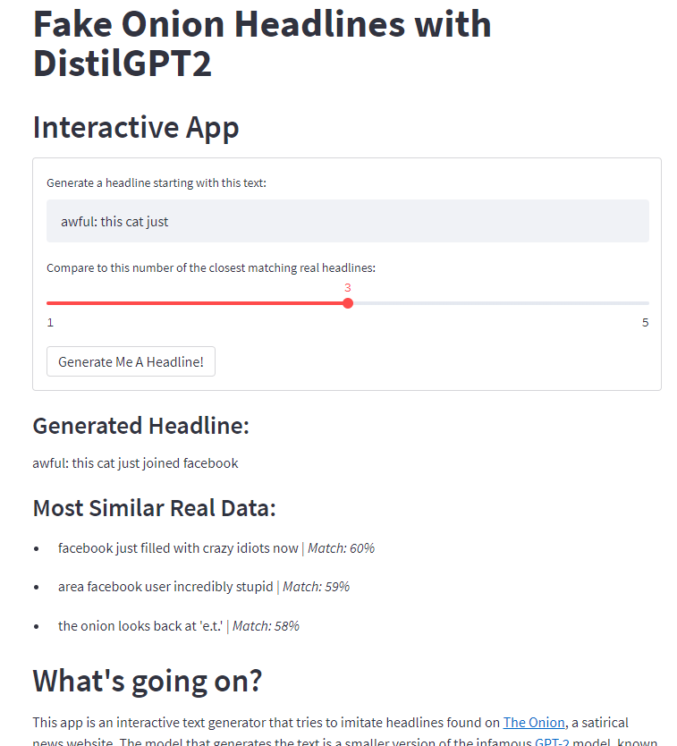

# fakeonion
An interactive Onion Headline generator using DistilGPT2 and Streamlit.



## Creating the Environment
### Automatic ENV Setup
I strongly recommend using the `fakeonion.yml` to build the environment.
```
conda env create -n fakeonion -f fakeonion.yml
```

### Manual ENV Setup
If you prefer to do it manually, beware of `protobuf` issues. 
```bash
conda create -n fakeonion pytorch=1.9 cudatoolkit=11.1 streamlit=0.89.0 fuzzywuzzy=0.18.0 transformers=4.11 -y
conda activate fakeonion
python -m pip install --upgrade protobuf
```
Versions are required here because conda cannot seem to solve the environment without them. After initial install of `protobuf` via conda, running streamlit results in a `AttributeError: module 'google.protobuf.descriptor' has no attribute '_internal_create_key'.` You must upgrade `protobuf` from pip to get rid of the error. I do not fully understand why there is a versioning issue with conda-forge that breaks streamlit, but it is a known issue, so there's hope it will be solved soon. **Do NOT allow later packages to install `protobuf` from conda-forge. This will break your Streamlit app.**

## Standing Up the App
```
conda activate fakeonion
streamlit run app.py
```


